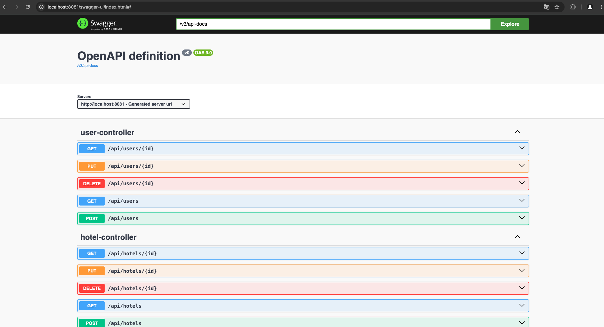

Voici la traduction en français du README et des classes que vous avez fournies :

---

# Projet site-travel

Ce projet **site-travel** est une application Spring Boot destinée à la gestion de voyages, réservations d'hôtels, vols, activités et paiements. L'application est conçue pour fournir une API RESTful pour gérer ces entités et permettre aux utilisateurs de rechercher des voyages par destination, dates, type, et d'autres critères.

## Contenu

1. [Pré-requis](#pré-requis)
2. [Installation](#installation)
3. [Configuration](#configuration)
4. [Utilisation](#utilisation)
5. [Structure des classes](#structure-des-classes)
   1. [Entités](#entités)
   2. [Contrôleurs](#contrôleurs)
   3. [Gestion des exceptions](#gestion-des-exceptions)
   4. [Configuration CORS](#configuration-cors)
6. [Dépendances](#dépendances)
7. [Documentation API](#documentation-api)
8. [Aperçu de l'Application](#aperçu-de-lapplication)
9. [Contributions](#contributions)

## Pré-requis

Pour exécuter ce projet, vous aurez besoin des éléments suivants :

- Java 17
- Maven 3.6+
- Une base de données (H2 pour le développement, MySQL pour la production)

## Installation

1. Clonez le dépôt :
   ```sh
   git clone https://github.com/Youssouf99/site-travel.git
   cd site-travel-api
   ```

2. Compilez le projet et téléchargez les dépendances :
   ```sh
   mvn clean install
   ```

## Configuration

1. Configurez votre base de données dans le fichier `src/main/resources/application.properties`.

   Pour H2 (base de données en mémoire) :
   ```properties
   spring.datasource.url=jdbc:h2:mem:testdb
   spring.datasource.driverClassName=org.h2.Driver
   spring.datasource.username=sa
   spring.datasource.password=password
   spring.jpa.database-platform=org.hibernate.dialect.H2Dialect
   ```

   Pour MySQL :
   ```properties
   spring.datasource.url=jdbc:mysql://localhost:3306/travel
   spring.datasource.username=votre-utilisateur
   spring.datasource.password=votre-mot-de-passe
   spring.jpa.hibernate.ddl-auto=update
   spring.jpa.database-platform=org.hibernate.dialect.MySQL5Dialect
   ```

2. Lancez l'application :
   ```sh
   mvn spring-boot:run
   ```

## Utilisation

Une fois l'application démarrée, vous pouvez accéder à l'API à l'adresse suivante :
```
http://localhost:8081/api/hotels
```

Vous pouvez utiliser Postman ou tout autre client HTTP pour interagir avec l'API.

## Structure des classes

Le projet contient plusieurs classes qui représentent les entités principales et les DTOs utilisés pour les échanges avec l'API.

### Entités

- `Travel`: Classe abstraite représentant un voyage avec des attributs communs comme nom, description, dates, prix, etc.
- `Hotel`, `Flight`, `Activity`: Classes étendant `Travel`, spécifiant des attributs supplémentaires propres à chaque type de voyage.
- `User`: Représente un utilisateur avec des attributs tels que prénom, nom, email, téléphone, etc.
- `Reservation`: Représente une réservation avec des détails comme le prix total, la date, l'utilisateur associé et les paiements effectués.
- `Payment`: Représente un paiement associé à une réservation, avec des détails comme le montant, la date et les informations de carte de crédit.

### Contrôleurs


#### `ActivityController`
Gère les opérations CRUD pour les activités.

#### `FlightController`
Gère les opérations CRUD pour les vols.

#### `HotelController`
Gère les opérations CRUD pour les hôtels ainsi que des recherches spécifiques.

#### `PaymentController`
Gère les opérations CRUD pour les paiements.

#### `ReservationController`
Gère les opérations CRUD pour les réservations.

#### `TravelController`
Gère les recherches et les opérations globales pour les voyages.

#### `UserController`
Gère les opérations CRUD pour les utilisateurs.

### Gestion des exceptions

Le projet inclut une gestion centralisée des exceptions à l'aide de `@ControllerAdvice` :

- `ExceptionHandlerAdvice` : Cette classe intercepte les exceptions non gérées et les renvoie dans un format standardisé.

### Exceptions personnalisées

- `NotFoundException` : Levée lorsque la ressource demandée n'est pas trouvée.
- `AvailableOfRoomsException` : Levée lorsqu'il n'y a plus de chambres disponibles.

### Structure de la réponse d'exception

La classe `ExceptionResponse` est utilisée pour formater la réponse de l'exception avec les champs suivants :
- `timestamp` : Date et heure de l'exception.
- `message` : Message d'erreur.
- `details` : Détails supplémentaires sur l'erreur.

### Configuration CORS

Le projet permet la configuration CORS pour permettre les requêtes provenant de différentes origines.

### WebClientConfig

La classe `WebClientConfig` configure les paramètres CORS pour permettre les appels API depuis une application front-end, par exemple une application React :

- `allowedOrigins` : Définit les origines autorisées.
- `allowedMethods` : Définit les méthodes HTTP autorisées (GET, POST, PUT, DELETE).
- `allowCredentials` : Permet l'envoi de cookies et d'en-têtes d'autorisation.

## Dépendances

Le projet utilise les dépendances suivantes :

- Spring Boot Actuator
- Spring Boot Data JPA
- Spring Boot HATEOAS
- Spring Boot Web
- Spring Boot DevTools
- H2 Database
- MySQL Connector
- Lombok
- Spring Boot Starter Test
- MapStruct
- SpringDoc OpenAPI

## Documentation API

L'API est documentée automatiquement grâce à **springdoc-openapi-starter-webmvc-ui** et est accessible à l'URL suivante après le démarrage de l'application :

```
http://localhost:8081/swagger-ui.html
```

## Aperçu de l'Application




## Contributions

Les contributions sont les bienvenues ! Veuillez suivre les étapes suivantes pour contribuer :

1. Forkez le dépôt
2. Créez une branche (`git checkout -b feature-nouvelle-fonctionnalité`)
3. Commitez vos modifications (`git commit -m 'Ajout d'une nouvelle fonctionnalité'`)
4. Poussez vers la branche (`git push origin feature-nouvelle-fonctionnalité`)
5. Ouvrez une Pull Request

---
