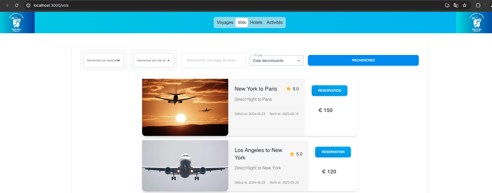

# site-travel-frontend

Le projet **site-travel-frontend** est une application frontend développée en React qui interagit avec l'API RESTful du projet **site-travel**. Cette application permet aux utilisateurs de rechercher des voyages, des réservations d'hôtels, des vols et des activités en fonction de différents critères.

## Fonctionnalités

- Recherche de voyages, d'hôtels, de vols et d'activités par destination, date et autres critères.
- Options de tri des résultats de recherche.
- Affichage paginé des résultats.
- Gestion des erreurs avec des messages d'alerte en cas de problème de chargement des données.

## Contenu

- [site-travel-frontend](#site-travel-frontend)
  - [Fonctionnalités](#fonctionnalités)
  - [Contenu](#contenu)
  - [Pré-requis](#pré-requis)
  - [Installation](#installation)
  - [Configuration](#configuration)
  - [Utilisation](#utilisation)
  - [Technologies utilisées](#technologies-utilisées)
  - [Structure du projet](#structure-du-projet)
  - [Aperçu de l'Application](#aperçu-de-lapplication)
  - [Auteur](#auteur)

## Pré-requis

Avant de commencer, assurez-vous d'avoir les éléments suivants installés sur votre machine :

- **Node.js** : Version 20.x ou supérieure
- **npm** : Version 10.x ou supérieure

## Installation

Pour installer et démarrer l'application frontend, suivez les étapes ci-dessous :

1. **Clonez le dépôt** :

   ```sh
   git clone https://github.com/Youssouf99/site-travel.git
   cd site-travel-frontend
   ```

2. **Installez les dépendances** :

   ```sh
   npm install
   ```

## Configuration

1. **Configuration du proxy pour l'API** :

   Le fichier `package.json` contient une section pour définir le proxy vers l'API backend du projet **site-travel** :

   ```json
   "proxy": "http://localhost:8081"
   ```

   Assurez-vous que cette URL correspond à l'URL où l'API backend est accessible.

2. **Variables d'environnement** :

   Créez un fichier `.env` à la racine du projet pour définir les variables d'environnement nécessaires, par exemple :

   `REACT_APP_API_BASE_URL=http://localhost:8081`

   Ces variables seront utilisées pour définir l'URL de base de l'API backend dans l'application.

## Utilisation

Pour démarrer l'application en mode développement, utilisez la commande suivante :

```sh
npm start
```

L'application sera accessible à l'adresse suivante :

```http://localhost:3000

```

## Technologies utilisées

- React
- Axios pour les requêtes HTTP
- Material-UI pour les composants d'interface utilisateur
- Tailwind CSS pour le styling

## Structure du projet

Le code source de l'application est organisé comme suit :

```site-travel-frontend/
  ├── public/              # Fichiers publics
  ├── src/                 # Code source de l'application
  │   ├── components/      # Composants réutilisables
  │   ├── assets/          # Assets statiques (images, données)
  │   ├── pages/           # Composants de page
  │   ├── services/        # Services pour les appels API
  │   ├── styles/          # Fichiers de style
  │   └── App.js           # Composant racine de l'application
  ├── .env                 # Configuration des variables d'environnement
  ├── package.json         # Dépendances du projet
  └── README.md            # Documentation du projet
```

## Aperçu de l'Application





## Auteur

[Youssouf]

---
